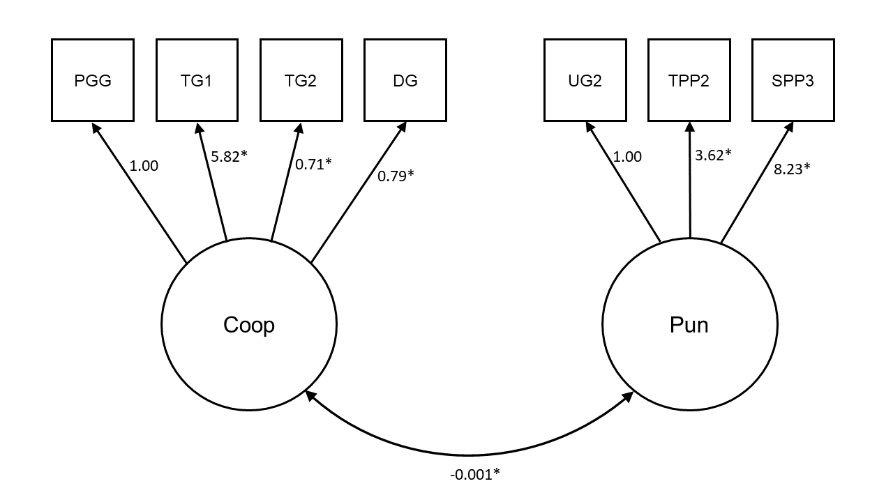
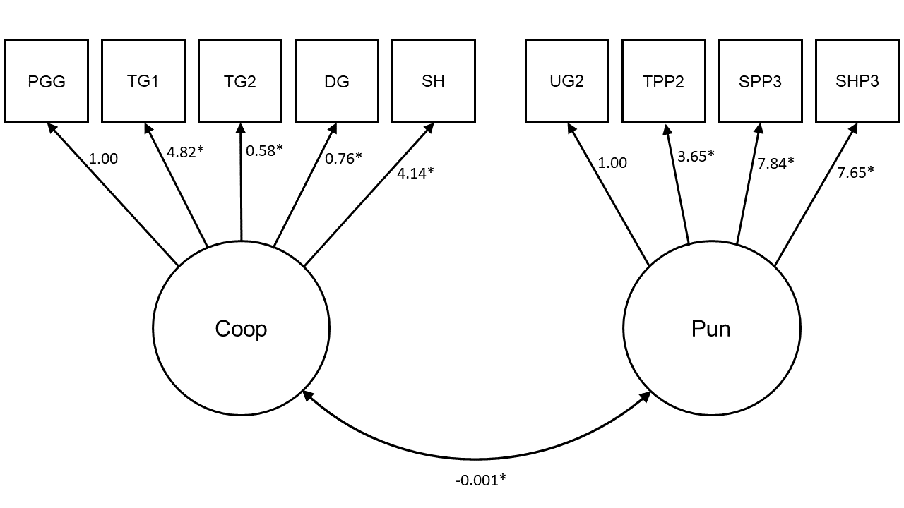

# Appendix to Chapter 3: Supplementary Materials

## Supplementary Methods

### Sample frame in Study 1

From the New Zealand Attitudes and Values Study, we included participants in our sample frame who: had completed Wave 4 of the study (_n_ = 12189); had also completed Wave 9 and/or Wave 10 (_n_ = 8095); had not subsequently withdrawn from the study at the time of sampling (_n_ = 7833); had consistently indicated at Wave 9 and 10 that they would be willing to participate in an additional online study (_n_ = 4181); had a valid email address (_n_ = 4040); were living in New Zealand (_n_ = 3955); were younger than 70 at the time of sampling (_n_ = 3374); and had a valid cell or landline number (_n_ = 3345). Of these 3345 participants, we attempted to contact 3063 about an additional study involving "economic decision-making in groups", and successfully contacted 2731 about the study.

### Additional information about study sessions in Studies 1 and 2

In Study 1, participants expressed interest in an initial phone call and were then emailed further information about the study. In Study 2, they were just sent an initial email. In both studies, the email asked them to complete a Qualtrics survey to specify their availability the following week. This survey removed any ineligible participants who (1) did not have adequate access to the Internet, (2) did not have a quiet place to participate in the study, and (3) did not have a New Zealand bank account (for payment purposes).

At the beginning of the study, participants first completed a consent form, in which they were informed of their confidentiality, right to withdraw, payment, and ethical approval. If they agreed to the consent form, participants read information about the economic games and then completed the games in a random order. After being randomly matched at the end of the session, participants saw a payoff screen which summarised the results of each individual game and how much they had earned from the study. Name and bank account details were collected at the end of the study. For security purposes, this information was encrypted while stored online and later decrypted on a local computer for payment.

Participants had a 55 minute limit to complete the games. If participants took longer than 55 minutes, the software skipped them ahead to the waiting lobby. Timeouts were still paid the \$20 show-up fee, but no bonus payment.

### Uneven session sizes in Studies 1 and 2

In Studies 1 and 2, session sizes were often not strict multiples of four necessary for real-time random matching, either due to unforeseen dropouts or uneven sign-ups. To remedy this, "simulated players" were used to round up uneven session sizes. These simulated players chose responses in the games based on the median responses from @Peysakhovich2014. Participants were made aware that they may be matched with simulated players, but only on the payoff screen _after_ all game decisions had been made: "In the rare event that we could not find a participant to match you with, we have instead matched you with average decisions based on previous research."

\newpage

\FloatBarrier

## Supplementary Figures

(ref:ch3samplePlotCaption) _Final sample characteristics (N = `r printnum(nrow(readd(ch3_d1)))`)._ Education is measured by NZREG, an ordinal scale measuring level of educational attainment (range = 0-10). Socio-economic status (SES) is measured by NZSEI, an ordinal rank measure based on occupational categories (range = 10-90). Local deprivation is measured by NZDEP, an ordinal rank measure of local deprivation for each meshblock in New Zealand (range = 840-1550). Social dominance orientation (SDO) and right-wing authoritarianism (RWA) are mean scores from six Likert scales (range = 1-7). The map of New Zealand shows meshblock locations for participants.

```{r ch3samplePlot, echo=FALSE, warning=F, message=F, fig.width=10, fig.height=6, fig.cap="(ref:ch3samplePlotCaption)", dev='cairo_pdf'}
readd(ch3_samplePlot)
```

\newpage

\FloatBarrier

(ref:ch3screePlotCaption) _Scree plots for (a) the principal components analysis in Study 1 with only the game decisions from previous work and (b) the extended principal components analysis in Study 1 including coordination games._ Principal components analyses initially contained as many factors as there were variables. Both scree plots show that only the first two factors have eigenvalues above 1, indicating a two-factor solution.

```{r ch3screePlot, echo=FALSE, warning=F, message=F, fig.width=8, fig.height=4, fig.cap="(ref:ch3screePlotCaption)"}
readd(ch3_screePlot)
```

\newpage

\FloatBarrier

(ref:ch3cfa1PlotCaption) _Confirmatory factor model in Study 1 using only the game decisions from previous work._ TG1 is treated as a binary endogenous variable, and paths for PGG and UG2 are constrained to 1. Note that the regression paths controlling for game comprehension are not included in this figure. Numbers are unstandardised coefficients. *_p_ < 0.05. PGG = Public Goods Game, TG1 = Trust Game (Give), TG2 = Trust Game (Return), DG = Dictator Game, UG2 = Ultimatum Game (Minimum Acceptable Offer), TPP2 = Third-Party Punishment Game (Punish), SPP3 = Second-Party Punishment Game (Punish Defector).

```{r ch3cfa1Plot, echo=FALSE, warning=F, message=F, out.width="100%", fig.cap="(ref:ch3cfa1PlotCaption)"}

```

\newpage

\FloatBarrier

(ref:ch3cfa2PlotCaption) _Confirmatory factor model in Study 1 with additional coordination games._ TG1 and SH are treated as binary endogenous variables, and paths for PGG and UG2 are constrained to 1. Note that the regression paths controlling for game comprehension are not included in this figure. Numbers are unstandardised coefficients. *_p_ < 0.05. PGG = Public Goods Game, TG1 = Trust Game (Give), TG2 = Trust Game (Return), DG = Dictator Game, SH = Stag Hunt Game, UG2 = Ultimatum Game (Minimum Acceptable Offer), TPP2 = Third-Party Punishment Game (Punish), SPP3 = Second-Party Punishment Game (Punish Defector), SHP3 = Stag Hunt Game with Punishment (Punish Defector).

```{r ch3cfa2Plot, echo=FALSE, warning=F, message=F, out.width="100%", fig.cap="(ref:ch3cfa2PlotCaption)"}

```

\newpage

\FloatBarrier

(ref:ch3indGamesPlotSDOCaption) _Individual game decisions predicting social dominance orientation in Study 1._ Lines are predictions from linear regressions, controlling for right-wing authoritarianism, game comprehension, and socio-demographics. Multiple comparisons are accounted for by using a Bonferonni-corrected alpha level. Blue plots are cooperation decisions, orange plots are punishment decisions. Numbers are unstandardised coefficients. *_p_ < 0.003. DG = Dictator Game, TG1 = Trust Game (Give), TG2 = Trust Game (Return), PGG = Public Goods Game, SH = Stag Hunt Game, UG1 = Ultimatum Game (Offer), TPP1 = Third-Party Punishment Game (Steal), SPP1 = Second-Party Punishment Game (Cooperate), SHP1 = Stag Hunt Game with Punishment (Coordinate), UG2 = Ultimatum Game (Minimum Acceptable Offer), TPP2 = Third-Party Punishment Game (Punish), SPP2 = Second-Party Punishment Game (Punish Cooperator), SPP3 = Second-Party Punishment Game (Punish Defector), SHP2 = Stag Hunt Game with Punishment (Punish Coordinator), SHP3 = Stag Hunt Game with Punishment (Punish Defector).

```{r ch3indGamesPlotSDO, echo=FALSE, warning=F, message=F, fig.width=7, fig.height=4, fig.cap="(ref:ch3indGamesPlotSDOCaption)"}
readd(ch3_indGamesPlotSDO)
```

\newpage

\FloatBarrier

(ref:ch3indGamesPlotRWACaption) _Individual game decisions predicting right-wing authoritarianism in Study 1._ Lines are predictions from linear regressions, controlling for social dominance orientation, game comprehension, and socio-demographics. Multiple comparisons are accounted for by using a Bonferonni-corrected alpha level. Blue plots are cooperation decisions, orange plots are punishment decisions. Numbers are unstandardised coefficients. *_p_ < 0.003. DG = Dictator Game, TG1 = Trust Game (Give), TG2 = Trust Game (Return), PGG = Public Goods Game, SH = Stag Hunt Game, UG1 = Ultimatum Game (Offer), TPP1 = Third-Party Punishment Game (Steal), SPP1 = Second-Party Punishment Game (Cooperate), SHP1 = Stag Hunt Game with Punishment (Coordinate), UG2 = Ultimatum Game (Minimum Acceptable Offer), TPP2 = Third-Party Punishment Game (Punish), SPP2 = Second-Party Punishment Game (Punish Cooperator), SPP3 = Second-Party Punishment Game (Punish Defector), SHP2 = Stag Hunt Game with Punishment (Punish Coordinator), SHP3 = Stag Hunt Game with Punishment (Punish Defector).

```{r ch3indGamesPlotRWA, echo=FALSE, warning=F, message=F, fig.width=7, fig.height=4, fig.cap="(ref:ch3indGamesPlotRWACaption)"}
readd(ch3_indGamesPlotRWA)
```

\newpage

\FloatBarrier

(ref:ch3policyR2PlotCaption) _Bar plots for (a) economic and (b) social policy views showing the proportion of variance explained (R^2^) by the cooperation latent variable, the punishment latent variable, and various socio-demographic controls individually, and their combination in a full model._ In Study 1, the cooperation latent variable explains a comparable proportion of variance in policy views to other socio-demographics.

```{r ch3policyR2Plot, echo=FALSE, warning=F, message=F, fig.width=7, fig.height=6, fig.cap="(ref:ch3policyR2PlotCaption)"}
readd(ch3_policyR2Plot)
```

\newpage

\FloatBarrier

(ref:ch3beastImagesCaption) _Images used in the BEAST task in rounds 1-5 (a-e)._

```{r ch3beastImages, echo=FALSE, warning=F, message=F, fig.width=6, fig.height=7, fig.cap="(ref:ch3beastImagesCaption)"}
readd(ch3_beastImages)
```

\newpage

\FloatBarrier

(ref:ch3histBEASTCaption) _Histogram of BEAST scores (averaged across all five rounds) in Study 2._

```{r ch3histBEAST, echo=FALSE, warning=F, message=F, warning=FALSE, message=FALSE, fig.width=7, fig.height=4, fig.cap="(ref:ch3histBEASTCaption)"}
readd(ch3_histBEAST)
```

\newpage

\FloatBarrier

(ref:ch3histRFCaption) _Histogram of rule following decisions in the Rule Following Task in Study 2._

```{r ch3histRF, echo=FALSE, warning=F, message=F, fig.width=7, fig.height=4, fig.cap="(ref:ch3histRFCaption)"}
readd(ch3_histRF)
```

\newpage

\FloatBarrier

## Supplementary Tables

(ref:ch3itemTableCaption) _Self-report items from the New Zealand Attitudes and Values Study used in both Studies 1 and 2._

```{r ch3itemTable, echo=F, warning=F, message=F}
knitr::kable(
  readd(ch3_itemTable),
  format = "latex",
  booktabs = TRUE,
  longtable = TRUE,
  caption = "(ref:ch3itemTableCaption)"
  ) %>%
  kable_styling(font_size = 10) %>%
  column_spec(1, width = "8em") %>%
  column_spec(2, width = "26em") %>%
  column_spec(3, width = "6em")
```

\newpage

\FloatBarrier

(ref:ch3semTableCaption) _Summary of the regression coefficients predicting the cooperation and punishment latent variables in the full structural equation model in Study 1._

```{r ch3semTable, echo=F, warning=F, message=F}
knitr::kable(
  readd(ch3_semTable),
  format = "latex",
  booktabs = TRUE,
  longtable = TRUE,
  caption = "(ref:ch3semTableCaption)",
  escape = FALSE,
  digits = 3
  ) %>%
  kable_styling(font_size = 10)
```

\newpage

\FloatBarrier

(ref:ch3policy01tableCaption) _Summary of the regression coefficients predicting preference for income redistribution (1-7) in the full structural equation model in Study 1._ Full item: "Redistributing money and wealth more evenly among a larger percentage of the people in New Zealand through heavy taxes on the rich." Dependent variable is treated as ordinal.

```{r ch3policy01table, echo=F, warning=F, message=F}
knitr::kable(
  readd(ch3_policy01table),
  booktabs = TRUE,
  caption = "(ref:ch3policy01tableCaption)",
  digits = 3,
  format = "latex",
  escape = FALSE,
  longtable = TRUE
  ) %>%
  kable_styling(font_size = 10)
```

\newpage

\FloatBarrier

(ref:ch3policy02tableCaption) _Summary of the regression coefficients predicting income attribution (1-7) in the full structural equation model in Study 1._ Full item: "Income equality reduces motivation to work hard." Dependent variable is treated as ordinal.

```{r ch3policy02table, echo=F, warning=F, message=F}
knitr::kable(
  readd(ch3_policy02table),
  booktabs = TRUE,
  caption = "(ref:ch3policy02tableCaption)",
  digits = 3,
  format = "latex",
  escape = FALSE,
  longtable = TRUE
  ) %>%
  kable_styling(font_size = 10)
```

\newpage

\FloatBarrier

(ref:ch3policy03tableCaption) _Summary of the regression coefficients predicting willingness to sacrifice for the environment (1-7) in the full structural equation model in Study 1._ Full item: "Are you willing to make sacrifices to your standard of living (e.g., accept higher prices, drive less, conserve energy) in order to protect the environment?" Dependent variable is treated as ordinal.

```{r ch3policy03table, echo=F, warning=F, message=F}
knitr::kable(
  readd(ch3_policy03table),
  booktabs = TRUE,
  caption = "(ref:ch3policy03tableCaption)",
  digits = 3,
  format = "latex",
  escape = FALSE,
  longtable = TRUE
  ) %>%
  kable_styling(font_size = 10)
```

\newpage

\FloatBarrier

(ref:ch3policy04tableCaption) _Summary of the regression coefficients predicting support for same-sex marriage (1-7) in the full structural equation model in Study 1._ Full item: "Support for same-sex marriage in NZ (The Marriage Amendment Act 2013)." Dependent variable is treated as ordinal.

```{r ch3policy04table, echo=F, warning=F, message=F}
knitr::kable(
  readd(ch3_policy04table),
  booktabs = TRUE,
  caption = "(ref:ch3policy04tableCaption)",
  digits = 3,
  format = "latex",
  escape = FALSE,
  longtable = TRUE
  ) %>%
  kable_styling(font_size = 10)
```

\newpage

\FloatBarrier

(ref:ch3policy05tableCaption) _Summary of the regression coefficients predicting support for euthanasia (1-7) in the full structural equation model in Study 1._ Full item: "Suppose a person has a painful incurable disease. Do you think that doctors should be allowed by law to end the patient's life if the patient requests it?" Dependent variable is treated as ordinal.

```{r ch3policy05table, echo=F, warning=F, message=F}
knitr::kable(
  readd(ch3_policy05table),
  booktabs = TRUE,
  caption = "(ref:ch3policy05tableCaption)",
  digits = 3,
  format = "latex",
  escape = FALSE,
  longtable = TRUE
  ) %>%
  kable_styling(font_size = 10)
```

\newpage

\FloatBarrier

(ref:ch3policy06tableCaption) _Summary of the regression coefficients predicting support for abortion (1-7) in the full structural equation model in Study 1._ Full item: "Support for legalized abortion for women, regardless of the reason." Dependent variable is treated as ordinal.

```{r ch3policy06table, echo=F, warning=F, message=F}
knitr::kable(
  readd(ch3_policy06table),
  booktabs = TRUE,
  caption = "(ref:ch3policy06tableCaption)",
  digits = 3,
  format = "latex",
  escape = FALSE,
  longtable = TRUE
  ) %>%
  kable_styling(font_size = 10)
```

\newpage

\FloatBarrier

(ref:ch3policy07tableCaption) _Summary of the regression coefficients predicting support for increased payments for those receiving Jobseeker Support (1-7) in the full structural equation model in Study 1._ Full item: "Increase payments for those receiving Jobseeker Support (formerly the Unemployment Benefit)." Dependent variable is treated as ordinal.

```{r ch3policy07table, echo=F, warning=F, message=F}
knitr::kable(
  readd(ch3_policy07table),
  booktabs = TRUE,
  caption = "(ref:ch3policy07tableCaption)",
  digits = 3,
  format = "latex",
  escape = FALSE,
  longtable = TRUE
  ) %>%
  kable_styling(font_size = 10)
```

\newpage

\FloatBarrier

(ref:ch3policy08tableCaption) _Summary of the regression coefficients predicting support for increased payments for those receiving Sole Parent Support (1-7) in the full structural equation model in Study 1._ Full item: "Increase payments for those receiving Sole Parent Support (formerly the Domestic Purposes Benefit)." Dependent variable is treated as ordinal.

```{r ch3policy08table, echo=F, warning=F, message=F}
knitr::kable(
  readd(ch3_policy08table),
  booktabs = TRUE,
  caption = "(ref:ch3policy08tableCaption)",
  digits = 3,
  format = "latex",
  escape = FALSE,
  longtable = TRUE
  ) %>%
  kable_styling(font_size = 10)
```

\newpage

\FloatBarrier

(ref:ch3policy09tableCaption) _Summary of the regression coefficients predicting support for a flat tax (1-7) in the full structural equation model in Study 1._ Full item: "Support for a 'flat' tax rate (everyone pays the same percentage of tax on their income)." Dependent variable is treated as ordinal.

```{r ch3policy09table, echo=F, warning=F, message=F}
knitr::kable(
  readd(ch3_policy09table),
  booktabs = TRUE,
  caption = "(ref:ch3policy09tableCaption)",
  digits = 3,
  format = "latex",
  escape = FALSE,
  longtable = TRUE
  ) %>%
  kable_styling(font_size = 10)
```

\newpage

\FloatBarrier

(ref:ch3beastTableCaption) _Summary of the fixed effects from the Bayesian multilevel beta regression model predicting BEAST scores in Study 2._

```{r ch3beastTable, echo=F, warning=F, message=F}
knitr::kable(
  readd(ch3_beastTable),
  booktabs = TRUE,
  caption = "(ref:ch3beastTableCaption)",
  digits = 3,
  format = "latex",
  escape = FALSE,
  col.names = c("IV", "Estimate", "SE", "Lower 95\\% CI", "Upper 95\\% CI")
  ) %>%
  kable_styling(font_size = 10)
```

\newpage

\FloatBarrier

(ref:ch3rfTableCaption) _Summary of the fixed effects from the Bayesian multilevel logistic regression model predicting rule following in Study 2._

```{r ch3rfTable, echo=F, warning=F, message=F}
knitr::kable(
  readd(ch3_rfTable),
  booktabs = TRUE,
  caption = "(ref:ch3rfTableCaption)",
  digits = 3,
  format = "latex",
  escape = FALSE,
  longtable = TRUE,
  col.names = c("IV", "Estimate", "SE", "Lower 95\\% CI", "Upper 95\\% CI")
  ) %>%
  kable_styling(font_size = 10)
```

\newpage

\FloatBarrier

(ref:ch3beastPolicyTable04Caption) _Summary of the regression coefficients predicting support for same-sex marriage (1-7) in the Bayesian ordinal regression model in Study 2._ Full item: Support for "same-sex marriage in NZ (The Marriage Amendment Act 2013)."

```{r ch3beastPolicyTable04, echo=F, warning=F, message=F}
knitr::kable(
  readd(ch3_beastPolicyTable04),
  booktabs = TRUE,
  caption = "(ref:ch3beastPolicyTable04Caption)",
  digits = 3,
  format = "latex",
  escape = FALSE,
  longtable = TRUE,
  col.names = c("IV", "Estimate", "SE", "Lower 95\\% CI", "Upper 95\\% CI")
  ) %>%
  kable_styling(font_size = 10)
```

\newpage

\FloatBarrier

(ref:ch3beastPolicyTable05Caption) _Summary of the regression coefficients predicting support for euthanasia (1-7) in the Bayesian ordinal regression model in Study 2._ Full item: "Suppose a person has a painful incurable disease. Do you think that doctors should be allowed by law to end the patient's life if the patient requests it?"

```{r ch3beastPolicyTable05, echo=F, warning=F, message=F}
knitr::kable(
  readd(ch3_beastPolicyTable05),
  booktabs = TRUE,
  caption = "(ref:ch3beastPolicyTable05Caption)",
  digits = 3,
  format = "latex",
  escape = FALSE,
  longtable = TRUE,
  col.names = c("IV", "Estimate", "SE", "Lower 95\\% CI", "Upper 95\\% CI")
  ) %>%
  kable_styling(font_size = 10)
```

\newpage

\FloatBarrier

(ref:ch3beastPolicyTable06Caption) _Summary of the regression coefficients predicting support for abortion for any reason (1-7) in the Bayesian ordinal regression model in Study 2._ Full item: Support for "legalized abortion for women, regardless of the reason."

```{r ch3beastPolicyTable06, echo=F, warning=F, message=F}
knitr::kable(
  readd(ch3_beastPolicyTable06),
  booktabs = TRUE,
  caption = "(ref:ch3beastPolicyTable06Caption)",
  digits = 3,
  format = "latex",
  escape = FALSE,
  longtable = TRUE,
  col.names = c("IV", "Estimate", "SE", "Lower 95\\% CI", "Upper 95\\% CI")
  ) %>%
  kable_styling(font_size = 10)
```

\newpage

\FloatBarrier

(ref:ch3beastPolicyTable10Caption) _Summary of the regression coefficients predicting support for abortion when the woman's life is endangered (1-7) in the Bayesian ordinal regression model in Study 2._ Full item: Support for "legalized abortion when the woman's life is endangered."

```{r ch3beastPolicyTable10, echo=F, warning=F, message=F}
knitr::kable(
  readd(ch3_beastPolicyTable10),
  booktabs = TRUE,
  caption = "(ref:ch3beastPolicyTable10Caption)",
  digits = 3,
  format = "latex",
  escape = FALSE,
  longtable = TRUE,
  col.names = c("IV", "Estimate", "SE", "Lower 95\\% CI", "Upper 95\\% CI")
  ) %>%
  kable_styling(font_size = 10)
```

\newpage

\FloatBarrier

(ref:ch3beastPolicyTable11Caption) _Summary of the regression coefficients predicting support for religious education in schools (1-7) in the Bayesian ordinal regression model in Study 2._ Full item: Support for "including religious instruction in Christianity as part of the school curriculum."

```{r ch3beastPolicyTable11, echo=F, warning=F, message=F}
knitr::kable(
  readd(ch3_beastPolicyTable11),
  booktabs = TRUE,
  caption = "(ref:ch3beastPolicyTable11Caption)",
  digits = 3,
  format = "latex",
  escape = FALSE,
  longtable = TRUE,
  col.names = c("IV", "Estimate", "SE", "Lower 95\\% CI", "Upper 95\\% CI")
  ) %>%
  kable_styling(font_size = 10)
```

\newpage

\FloatBarrier

(ref:ch3beastPolicyTable12Caption) _Summary of the regression coefficients predicting race essentialism (1-7) in the Bayesian ordinal regression model in Study 2._ Full item: "To a large extent, a person's race biologically determines his or her abilities."

```{r ch3beastPolicyTable12, echo=F, warning=F, message=F}
knitr::kable(
  readd(ch3_beastPolicyTable12),
  booktabs = TRUE,
  caption = "(ref:ch3beastPolicyTable12Caption)",
  digits = 3,
  format = "latex",
  escape = FALSE,
  longtable = TRUE,
  col.names = c("IV", "Estimate", "SE", "Lower 95\\% CI", "Upper 95\\% CI")
  ) %>%
  kable_styling(font_size = 10)
```

\newpage

\FloatBarrier

(ref:ch3beastPolicyTable13Caption) _Summary of the regression coefficients predicting prejudice against homosexuality (1-7) in the Bayesian ordinal regression model in Study 2._ Full item: "I think that homosexuality should be accepted by society" (reversed).

```{r ch3beastPolicyTable13, echo=F, warning=F, message=F}
knitr::kable(
  readd(ch3_beastPolicyTable13),
  booktabs = TRUE,
  caption = "(ref:ch3beastPolicyTable13Caption)",
  digits = 3,
  format = "latex",
  escape = FALSE,
  longtable = TRUE,
  col.names = c("IV", "Estimate", "SE", "Lower 95\\% CI", "Upper 95\\% CI")
  ) %>%
  kable_styling(font_size = 10)
```
