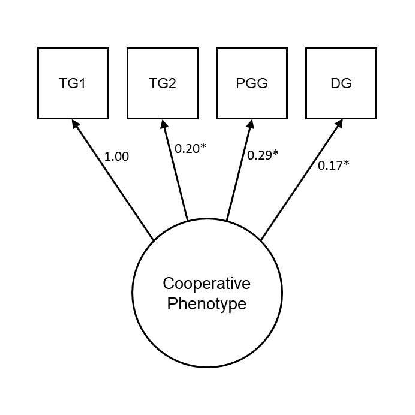

# Appendix to Chapter 5: Supplementary Materials

## Supplementary Figures

(ref:ch5timelinePlotCaption) _Data collection timeline for NZAVS Wave 10, NZAVS Wave 11, and both waves of economic game data collection (N = `r printnum(nrow(readd(ch5_d)))`)._ Each point is an individual participant. Note the break in data collection in February 2019 due to the Christchurch terrorist attack.

```{r ch5timelinePlot, echo=FALSE, warning=F, message=F, fig.width=7, fig.height=5, fig.cap="(ref:ch5timelinePlotCaption)"}
readd(ch5_timeline)
```

\newpage

\FloatBarrier

(ref:ch5impPlotCaption) _Density plots showing imputed values from 20 multiply imputed datasets (pink) against observed values (blue)._ Data were imputed using predictive mean matching.

```{r ch5impPlot, echo=FALSE, warning=F, message=F, fig.width=16, fig.height=10, fig.cap="(ref:ch5impPlotCaption)"}
readd(ch5_plotImputation)
```

\newpage

\FloatBarrier

(ref:ch5cfa1PlotCaption) _Confirmatory factor model for the cooperative phenotype in Wave 2._ TG1 is treated as a binary endogenous variable, and the path for TG1 is constrained to 1. Numbers are unstandardised coefficients. *_p_ < 0.05. TG1 = Trust Game (Give), TG2 = Trust Game (Return), PGG = Public Goods Game, DG = Dictator Game.

```{r ch5cfa1Plot, echo=FALSE, warning=F, message=F, out.width="80%", fig.cap="(ref:ch5cfa1PlotCaption)"}

```

\newpage

\FloatBarrier

(ref:ch5sem1PlotCaption) _Social dominance orientation (mean score) is negatively related to model-predicted cooperation latent variable scores._

```{r ch5sem1Plot, echo=FALSE, warning=F, message=F, out.width="80%", fig.cap="(ref:ch5sem1PlotCaption)"}
readd(ch5_plotSem1)
```

\newpage

\FloatBarrier

(ref:ch5clpmPlotIncRedCaption) _The cooperative phenotype predicts later support for income redistribution._ (_a_) Cross-lagged panel model with the cooperative phenotype and support for income redistribution. Support for income redistribution is treated as ordinal. Note that measurement models for the cooperative phenotype latent variables are omitted from this figure. Numbers are standardised coefficients, *_p_ < 0.05. (_b_, _c_) Forest plots visualising the change in cross-lagged paths when controlling for time-invariant covariates, individually and in a full model. Points are unstandardised estimates, lines are 95% confidence intervals.

```{r ch5clpmPlotIncRed, echo=FALSE, warning=F, message=F, fig.width=6, fig.height=6, fig.cap="(ref:ch5clpmPlotIncRedCaption)"}
readd(ch5_clpmPlot_IncRed)
```

\newpage

\FloatBarrier

(ref:ch5clpmPlotIncAttCaption) _The cooperative phenotype and income attribution beliefs do not predict one another over time._ (_a_) Cross-lagged panel model with the cooperative phenotype and income attribution beliefs. Income attribution beliefs are treated as ordinal. Note that measurement models for the cooperative phenotype latent variables are omitted from this figure. Numbers are standardised coefficients, *_p_ < 0.05. (_b_, _c_) Forest plots visualising the change in cross-lagged paths when controlling for time-invariant covariates, individually and in a full model. Points are unstandardised estimates, lines are 95% confidence intervals. 

```{r ch5clpmPlotIncAtt, echo=FALSE, warning=F, message=F, fig.width=6, fig.height=6, fig.cap="(ref:ch5clpmPlotIncAttCaption)"}
readd(ch5_clpmPlot_IncAtt)
```

\newpage

\FloatBarrier

(ref:ch5clpmPlotPolNatCaption) _The cooperative phenotype and support for the National Party do not predict one another over time._ (_a_) Cross-lagged panel model with the cooperative phenotype and support for the National Party. Support for the National Party is treated as ordinal. Note that measurement models for the cooperative phenotype latent variables are omitted from this figure. Numbers are standardised coefficients, *_p_ < 0.05. (_b_, _c_) Forest plots visualising the change in cross-lagged paths when controlling for time-invariant covariates, individually and in a full model. Points are unstandardised estimates, lines are 95% confidence intervals.

```{r ch5clpmPlotPolNat, echo=FALSE, warning=F, message=F, fig.width=6, fig.height=6, fig.cap="(ref:ch5clpmPlotPolNatCaption)"}
readd(ch5_clpmPlot_PolNat)
```

\newpage

\FloatBarrier

## Supplementary Tables

(ref:ch5itemTableCaption) _Self-report items from the New Zealand Attitudes and Values Study._

```{r ch5itemTable, echo=F, warning=F, message=F}
knitr::kable(
  readd(ch5_itemTable), format = "latex",
  booktabs = TRUE, longtable = TRUE,
  caption = "(ref:ch5itemTableCaption)"
  ) %>%
  kable_styling(font_size = 10) %>%
  column_spec(1, width = "8em") %>%
  column_spec(2, width = "26em") %>%
  column_spec(3, width = "6em")
```
