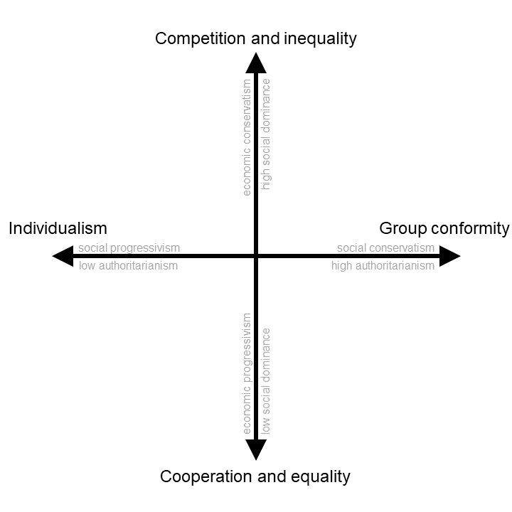

--- 
bibliography: citations.bib
output:
  bookdown::pdf_book:
    pandoc_args: [ "--csl", "apa.csl" ]
    toc: no
    template: null
    includes:
      in_header: tex/preamble.tex
      before_body: tex/doc_preface.tex
documentclass: book
classoption: oneside
fontsize: 12pt
subparagraph: yes
link-citations: yes
indent: true
nocite: |
  @Aristotle
---

# Introduction

> Man is by nature a political animal.
> `r tufte::quote_footer('--- Aristotle (ca. 370 B.C.E./1998)')`

> The roots of politics are older than humanity.
> `r tufte::quote_footer('--- Frans @DeWaal1982, p. 207')`

Over the last decade, major political events have shaken the world. In 2016, the United Kingdom voted to leave the European Union. In the same year, Donald Trump was elected President of the United States, followed by his eventual impeachment. More recently, political decision-making from international leaders has determined the course of the global COVID-19 pandemic. All the while, people across the world have made their voices heard through political protest and demonstration. In the United States, organisations like Black Lives Matter and Occupy Wall Street amplified people's dissatisfaction with existing racial and economic inequalities. In Europe, the political activist Greta Thunberg inspired a generation of young people to fight climate change. In the Arab world, the Arab Spring protests in the early 2010s sought to overthrow authoritarian regimes. These examples highlight how important political motives are to human social life.

Some scholars argue that our political motives emerged deep in our evolutionary history. Indeed, our close primate cousins also exhibit a range of political behaviours. In _Chimpanzee Politics_, @DeWaal1982 documented countless examples of coalition formation, competition, hierarchical dominance struggles, status seeking, and Machiavellian social intelligence among captive chimpanzees. @Goodall1982 also observed these behaviours in a wild population of Gombe chimpanzees, and added further observations of aggressive behaviour to maintain social order and territorial coalitional defence against strangers. Such socio-political behaviours are also found in other great apes [@Scott2007; @Stanford1998] and possible analogies can be found in a subset of non-primate animal species [e.g., inter-group competition and cooperation in ants; @VanWilgenburg2010]. These social behaviours in non-human animals have attracted attention because of their apparent parallels with human socio-political behaviour. Human politics are rife with disagreements regarding the status of social groups, leadership, political deception, law and order, military defence, and immigration. The parallels between human and non-human political behaviour support Aristotle's contention that man is a "political animal" whose social instincts are shared by other gregarious creatures [@Abbate2016].

The aim of this thesis is to understand how evolution could have produced a political animal like humans. To answer this question, we begin from first principles. At its most fundamental, politics is the process of "solv[ing] the coordination problems that emerge from group living" [@Petersen2015, p. 1085]. This is as true for chimpanzees and ants as it is for humans. Whether it is governing how resources are distributed among the group, which norms are imposed upon the group, who leads the group, or how in-group deviants are reprimanded, politics allows groups of individuals with conflicting interests to coordinate on mutually beneficial ways to organise social life.

Since politics is fundamentally tied to social life, any understanding of the evolution of human political psychology must be consistent with research on the evolution of human group living. Across the evolutionary human sciences, a burgeoning literature has emerged explaining how human social life has expanded from small-scale ancestral groups characteristic of other great apes to large-scale modern societies containing millions of people [@Tomasello2012; @Tomasello2016; @Sterelny2016; @Kramer2019]. This expansion is particularly puzzling to explain given the free-rider problem, in which sociable individuals are outcompeted by selfish free-riders who exploit the generosity of others [@Nowak2006]. In order to explain the expansion of human groups from small-scale bands to large-scale modern societies, @Sterelny2016 argues that a series of social revolutions shaped human social evolution: a transition from great ape social life to late-Pleistocene hunter-gatherer groups, and, subsequently, a transition during the Holocene from hunter-gatherer groups to large-scale cities and nation states with formal political institutions.

In this thesis, I will argue that the structure of political ideology in modern humans, as well as the variation in political attitudes that we see expressed today, is the result of changes that occurred during the transition from great ape social life to more complex hunter-gatherer groups. The differences between great ape and hunter-gatherer lifeways are stark. Chimpanzee social groups, for example, are characterised by small multi-family bands, strict dominance hierarchies which determine the flow of resources, and limited cultural learning [@DeWaal1982]. By contrast, hunter-gatherer social groups are characterised by extended networks of contact and trade [@Bird2019; @Hill2011; @Lee1972], obligate cooperation [@Tomasello2012], relative egalitarianism [@Boehm1993], and a plethora of different cultural norms, traditions, and institutions that govern the behaviour of group members [@Henrich2015]. What changes account for this transition in the default mode of group living?

Drawing from research in anthropology, primatology, and developmental psychology, @Tomasello2012 suggest that the transition from great ape to hunter-gatherer social life comprised of two distinct shifts. In the first key shift, a variety of socio-ecological pressures selected for obligate cooperation in early humans after their divergence from other great apes. As inter-birth intervals decreased and humans began to have more children, cooperative breeding (i.e., non-relatives caring for infants) became essential for offspring to survive [@Burkart2009; @Kramer2019]. In order to forage great distances for food and hunt large game with unpredictable returns, early humans were also required to collaborate in their foraging efforts [@Gurven2004; @Kramer2019] and share the spoils of their cooperation more evenly as a system of risk pooling [@Gurven2004]. Building on existing systems of kin altruism and reciprocity, these changes created greater interdependence between group members [@Aktipis2018], further increasing the levels of cooperation within groups.

In the second key shift, humans became more group-minded, conforming to social norms in culturally marked groups and punishing norm-violators [@Tomasello2012]. As interactions with strangers became more common in larger groups, socially-learned cultural norms allowed even unfamiliar individuals to effectively coordinate their behaviour [@Cronk2013]. Inter-group competition also favoured punishment of individuals that did not adhere to cultural norms and a unifying sense of group identity that bound the group together in the face of external threats [@Mathew2011]. This group-mindedness allowed human groups to expand even further in scale and social complexity. Thus, the two key shifts in the transition from great ape to hunter-gatherer groups --- _cooperation_ and _group conformity_ --- transformed the ways in which humans solved the challenges of group living.

The key insight is that these two key shifts are strikingly concordant with the identification of two dimensions of political ideology in modern humans (Figure \@ref(fig:ch1twoDimensions)). Decades of research in political, social, moral, and cross-cultural psychology have revealed two dimensions of political ideology, often labelled as economic and social conservatism [@Feldman2014], or social dominance and authoritarianism [@Duckitt2009]. I believe that this is no accident. Here, I propose that the two key shifts in the transition from great ape to hunter-gatherer social life produced the two dimensions of political ideology in modern humans. I refer to this theory as the _dual evolutionary foundations of political ideology_.

(ref:ch1twoDimensionsCaption) _The two-dimensional landscape of political ideology._ The vertical axis represents variation in economic conservatism and social dominance, which reflects preferences for competition and inequality vs. cooperation and equality. The horizontal axis represents variation in social conservatism and authoritarianism, which reflects preferences for individualism vs. group conformity.

```{r ch1twoDimensions, echo=F, fig.cap = "(ref:ch1twoDimensionsCaption)", out.width = "\\textwidth"}

```

Of course, the cities and nation states governed by today's politics are vastly different from the hunter-gatherer groups that organised human social life in the late-Pleistocene. Indeed, since the dawn of agriculture and throughout the Holocene, human social groups have continued to expand in size and social complexity, eventually dominating the globe [@Sterelny2016]. But this was a relatively fast expansion compared to the evolution of hunter-gatherer social organisation, spanning thousands rather than millions of years. It was also likely driven by a process of cultural rather than genetic evolution, in which socially-learned norms, institutions, and technologies [e.g., religion; @Norenzayan2016] built upon existing evolved psychological mechanisms to promote cooperative behaviour in large-scale anonymous groups [@Richerson2016]. Yet, despite this expansion in scale, the fundamental challenges of group living (how to distribute resources, which norms to impose, how to sanction in-group deviants, etc.) have remained unchanged, as has the psychology that deals with those challenges. As we will explore, today's politics reflect ancient social tensions that naturally arise from group living.

The structure of this thesis is as follows. In Chapter 2, I fully outline the dual evolutionary foundations framework. I begin by emphasising the two-dimensional nature of political ideology and justifying an evolutionary approach to understanding these two dimensions. I then introduce the dual evolutionary foundations theory as a framework that can organise and expand on previous evolutionary accounts of the two dimensions of political ideology. In laying out the framework, I discuss in more detail the two key shifts in human social evolution --- from competitive hierarchy to cooperative egalitarianism, and from individualism to group conformity --- and how these fundamental trade-offs in human group living can explain variation in the two dimensions of political ideology. I conclude by using the framework to explain the political attitudes and values of modern humans.

One key prediction of the dual evolutionary framework is that the two dimensions of political ideology in modern humans should reflect behavioural preferences for cooperation and group conformity. The remainder of the thesis proceeds to empirically test this prediction. The organising approach underlying all of these empirical chapters is to, first, measure behavioural preferences in abstract incentivised tasks and, second, relate these preferences to variation in political attitudes and values. This is a departure from the traditional approach in political psychology, in which researchers tend to rely on self-report measures that ask people to explicitly state their political opinions, party preferences, and prejudices [@Duckitt2009]. Some have argued that, due to issues like social desirability and experimenter demand, self-report measures do not fully capture the political mind [@Burdein2006; @Gawronski2015]. By contrast, incentivised behavioural tasks (i.e., social decision-making tasks that involve real money) are tools that elicit private behavioural preferences, such as a willingness to share, while avoiding the desirability issues that plague self-report methods [@Pisor2020]. It costs nothing to state a willingness to share on paper, but incentivised behavioural tasks require people to put their money where their mouth is [@Chaudhuri2009]. Moreover, incentivised behavioural tasks do not contain any political content. This avoids the problem of circular reasoning that some have attributed to existing scales of political ideology, in which self-report items contain the very attitudes they seek to explain [@Malka2017].

In Chapter 3, I present the results of a study in which hundreds of New Zealanders completed an online battery of real-time interactive behavioural tasks measuring cooperation and conformity. In line with the dual evolutionary framework, cooperative and conformist preferences in these tasks predict the two dimensions of political ideology. I also find that behavioural preferences predict support for a host of economic and social policy views, such as views on income redistribution, welfare, taxation, abortion, homosexuality, and religious instruction in schools. By contrast, I find that several behavioural measures of conformity (norm-enforcing punishment and rule following) are not related to authoritarianism or social policy views, raising questions about the nature of conformist preferences and the validity of different incentivised behavioural tasks.

Chapter 4 expands on these results by using the same dataset and additionally relating cooperative and conformist preferences to support for New Zealand political parties. As expected, cooperative preferences predict support for economically progressive political parties, like the Labour Party and the Green Party, and these associations hold even after controlling for socio-demographic variables known to predict political party support (e.g., age, gender, education). Moreover, in line with the dual evolutionary framework, I find that conformist preferences weakly predict support for the socially conservative New Zealand First Party.

Since the data from Chapters 3 and 4 were collected alongside a longitudinal survey of the attitudes and values of New Zealanders, it was also possible to study how changes in behavioural preferences over time predicted subsequent changes in political ideology. In Chapter 5, I use longitudinal data to test between alternative causal models of the relationship between behavioural preferences and political ideology. In line with the dual evolutionary framework, changes in cooperative preferences _precede_ changes in political ideology, suggesting a causal path from more general behavioural preferences to ideology.

In Chapter 6, I generalise previous results from New Zealand by collecting data with new behavioural measures in another country, the United States. In particular, I measure how people distribute resources and how harsh they perceive the social norms governing those resource distributions to be. Building on previous chapters, I find that egalitarian cooperative preferences and perceptions of harsh social norms are related to the two dimensions of political ideology, in accordance with the dual evolutionary framework. By contrast, I find that general selfishness and adherence to social norms are unrelated to political ideology, further elucidating the psychological mechanisms motivating cooperative and conformist behaviour across the political landscape.

The thesis concludes with a general discussion of the empirical findings in relation to the dual evolutionary framework. In the discussion, I summarise what we have learned about the behavioural preferences underlying the two dimensions of political ideology, and feed the empirical findings back to the theoretical framework. Finally, I propose some exciting avenues for future research.

That's the road ahead. But before getting to empirical work, I must first explain what political ideology is, how it is organised, and how an evolutionary approach can help us understand its deep origins in humans.
